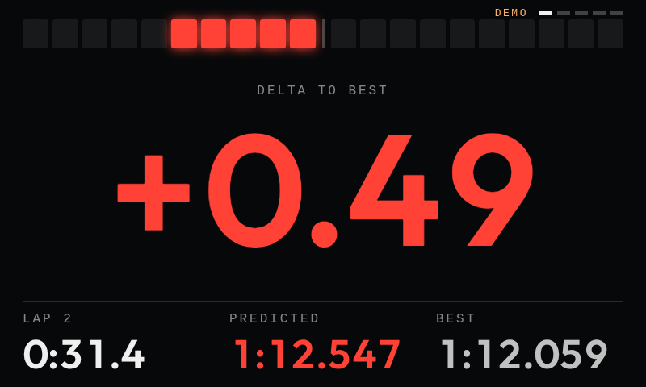
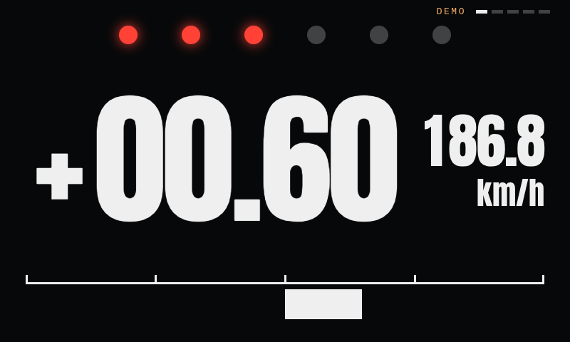
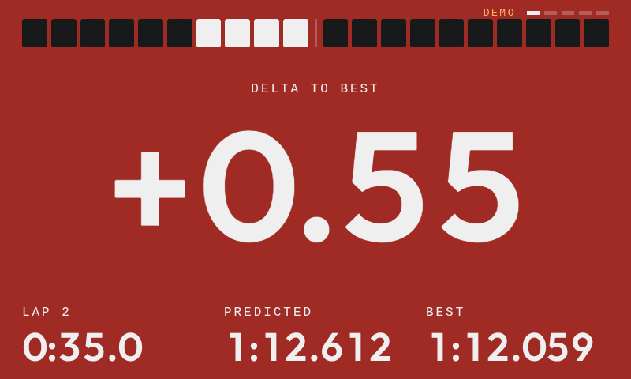
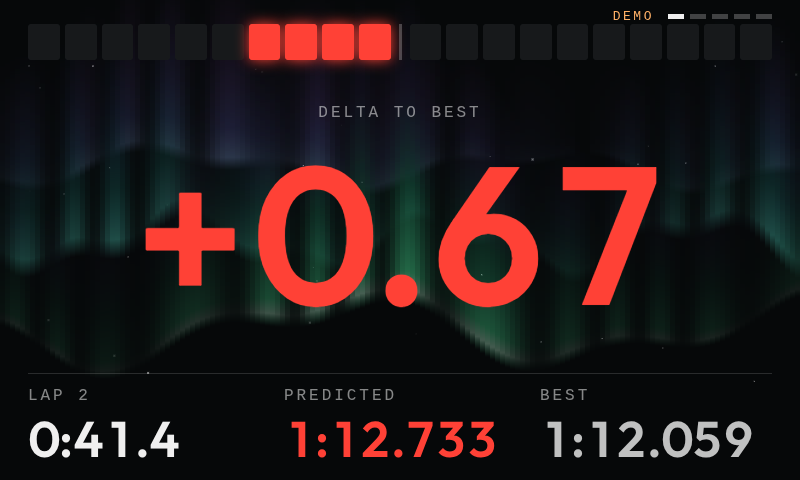
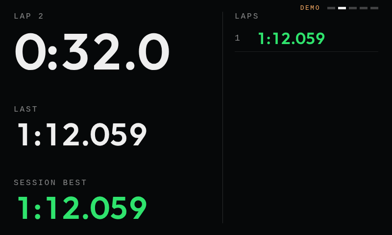
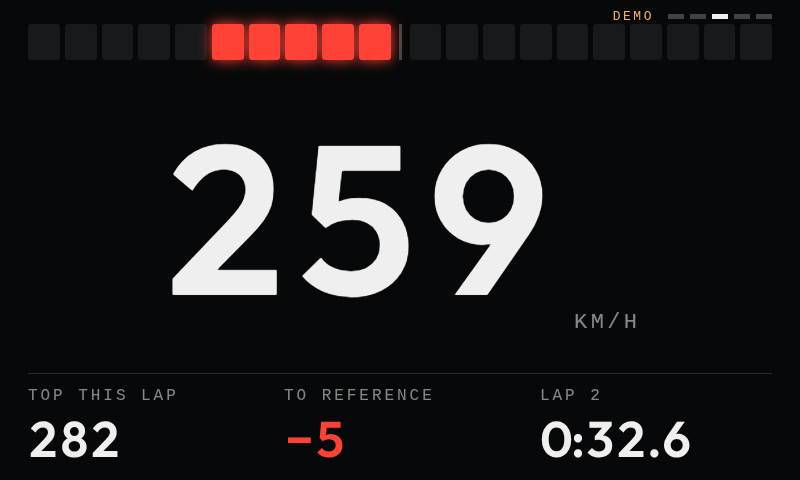
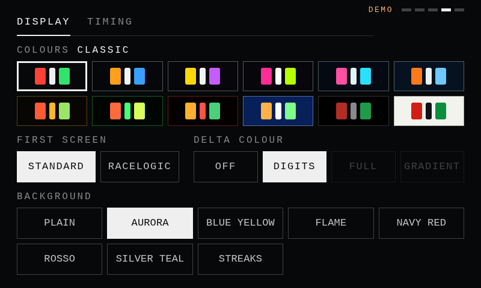
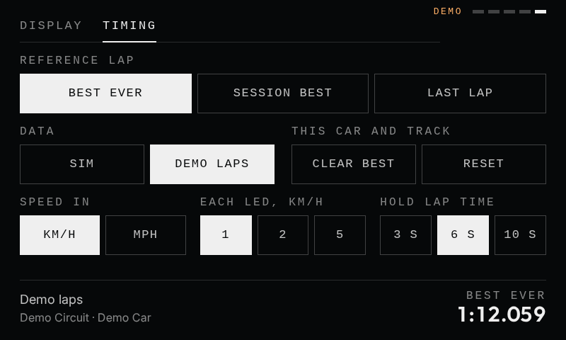
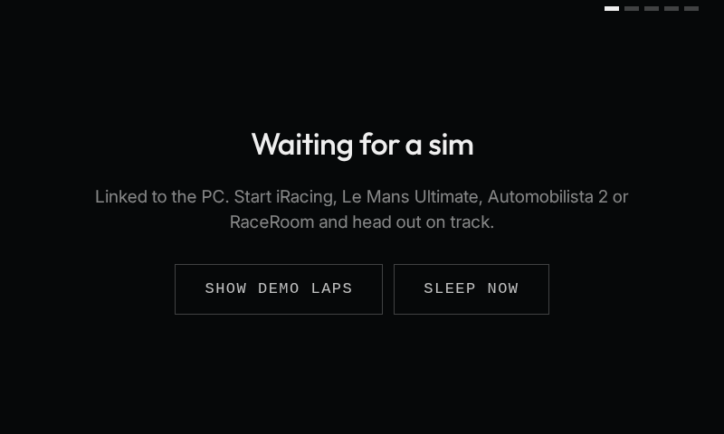

# Az Lap Timer

A predictive lap timer for sim racing that runs on a Spotify Car Thing. It shows a live delta
against your reference lap, a predicted lap time, lap times, and speed, read straight from the
sim on your PC.

It is an app for [bridgething](https://bridgething.com), the open firmware that turns a Car Thing
into a small programmable display, and it borrows its idea from the Racelogic VBOX LapTimer.



## What it does

- **Live delta and predicted lap time** against your best ever lap, your session best, or your
  last lap. In iRacing these are iRacing's own numbers, so they match the car's dash and overlays.
- **LED strip** that shows whether you are carrying more or less speed than the reference lap did
  at this point on track.
- **Lap times**: the finished lap is held on screen for a few seconds at the line, with a list of
  the session's laps a button press away.
- **Speedometer** with top speed for the lap.
- **Four sims**: iRacing, Le Mans Ultimate, Automobilista 2, and RaceRoom. It finds whichever one
  is running.
- **Your choice of look**: twelve colour schemes, an optional Racelogic-style first screen, the
  delta colour on the digits or flooding the whole screen, and moving backgrounds.
- **Sleeps when you are not driving**: after three minutes with no sim running, or at a tap of
  Sleep now on the waiting screen, the screen goes black and the backlight turns right down. A
  touch, a button, the dial, or a sim starting wakes it and puts the brightness back.

## Screens

|                                                                              |                                                                       |
| ---------------------------------------------------------------------------- | --------------------------------------------------------------------- |
|                |   |
| **Racelogic look.** Six lamps, condensed numerals, speed, and a delta-T bar. | **Delta colour across the screen**, blending as the gap changes.      |
|                |                   |
| **Moving background.** Aurora, one of the backgrounds that ship with it.     | **Laps.** This lap, the last, the session best, and the run so far.   |
|                             |  |
| **Speed**, with the gap to the reference lap's speed at this point.          | **Display options**, on the device itself.                            |
|           |        |
| **Timing options.** Reference lap, units, and what the LEDs stand for.       | **Waiting for a sim**, with demo laps and sleep a tap away.           |

These are screenshots taken off a Car Thing, with demo laps on the timing screens.

## Controls

| Control        | Does                                          |
| -------------- | --------------------------------------------- |
| Preset 1       | Delta: live gap to the reference, predicted   |
| Preset 2       | Laps: current, last, session best, lap list   |
| Preset 3       | Speed: speedometer and top speed this lap     |
| Preset 4       | Options: Display page, press again for Timing |
| Dial           | Step through the screens                      |
| Back           | Return to Delta; on Delta, leave demo laps    |
| Tap the screen | Next timing screen                            |

The **Display** page sets how it looks:

- one of twelve colour schemes
- whether the first screen uses the standard look or copies a Racelogic VBOX LapTimer
- where the delta's colour goes: nowhere, onto the digits, across the whole screen in one colour or
  the other, or across the whole screen as a blend between the two as the gap changes
- a plain background or a moving one. A colour that fills the screen would hide a moving
  background, so while one is on the digits carry the colour instead

The **Timing** page picks the reference lap, switches between the sim and demo laps, clears the
best lap or resets the session, and sets km/h or mph, how much speed each LED stands for, and how
long a finished lap stays up.

All of these choices are kept on the Car Thing. A lap through the pits, or one the sim
invalidates, is listed but never becomes the reference.

## Sims

| Sim              | Setup needed                                                     | Tried in a live session |
| ---------------- | ---------------------------------------------------------------- | ----------------------- |
| iRacing          | None                                                             | Yes                     |
| Le Mans Ultimate | None, on a build that has the `LMU_Data` shared memory interface | Not yet                 |
| Automobilista 2  | Options > System > Shared Memory > `Project CARS 2`              | Not yet                 |
| RaceRoom         | None                                                             | Not yet                 |

The three marked "not yet" are written from each sim's published memory layout and tested against
made-up data, but have not been driven with. Each reader checks the layout it finds and stands
down with a message in the log if it does not match, so the worst case should be a sim that is
not picked up. Reports are welcome.

In iRacing the delta shown is iRacing's own. "Best ever" there means the best lap iRacing has
stored for the car and track. The other sims have no delta of their own, so theirs is worked out
from the laps the timer has recorded: your time into the lap against the reference lap's time at
the same point on track.

## What you need

- A Spotify Car Thing flashed with [bridgething](https://bridgething.com)
- A Windows PC running the sim, with the bridgething desktop app and the Car Thing plugged in
  over USB
- [Bun](https://bun.sh), only if you build it yourself

The sim readers use Windows shared memory, so the PC half is Windows only.

## Install

Flash the Car Thing from <https://bridgething.com> (Chrome, USB-C cable) and install the
bridgething desktop app on the sim PC. Then get the app one of two ways.

### From the store

1. In the desktop app, open the store screen.
2. Find **Lap Timer** under **community apps**. If it is not listed, paste this address into
   **browse a source by url** and add the source it opens:

   ```text
   https://azlum0.github.io/AzLapTimer/catalog.v1.json
   ```

3. Install it. It will ask you to allow the extension to load native libraries, which is how it
   reads the sim's memory.

New versions show up in the store as updates.

### From this repo

1. Build and package:

   ```sh
   bun install
   bun run build
   bun run share
   ```

2. On the desktop app's store screen, find **install a local bundle** and pick
   `apps/lap-timer/Lap-Timer-<version>.zip`. It asks for the same permission.

Either way, the desktop app copies the screen half to the Car Thing and keeps the PC half for itself, so the
timer works whenever the desktop app is open. Turn on **start with this computer** in its settings
and there is nothing to launch.

## Try it with no Car Thing

```sh
bun install
bun run dev
```

Open <http://localhost:5173/?demo> for made-up laps. Keys `1` to `4` and `Escape` stand in for the
buttons, and shift + scroll for the dial.

To watch a real sim in the browser, run the telemetry half on its own in a second terminal and
open <http://localhost:5173/?ws=ws://127.0.0.1:8765>:

```sh
bun run --cwd apps/lap-timer probe
```

The probe prints what it reads once a second, which is also the quickest way to check that a sim
is being picked up.

## How it works

```text
   sim (PC)                 extension (PC)                   Car Thing
┌────────────┐  shared   ┌──────────────────┐   USB    ┌──────────────────┐
│ iRacing,   │──memory──►│ reads telemetry, │─────────►│ draws the screens│
│ LMU, AMS2, │           │ times the laps,  │ forward  │ 800x480          │
│ RaceRoom   │           │ keeps best laps  │◄─────────│ sends settings   │
└────────────┘           └──────────────────┘          └──────────────────┘
```

The app has two halves, both in `apps/lap-timer`:

- `extension/` runs on the PC as a Deno process started by the bridgething desktop app. It finds
  whichever sim is running, reads its shared memory, times the laps, and stores your best lap for
  each car and track.
- `src/` runs on the Car Thing and draws what the extension sends.

Adding a sim means one file in `apps/lap-timer/extension/sources/` that turns its telemetry into
a `Sample`, plus a line in `sources/index.ts`.

## Moving backgrounds

A background is a single file in [Assets](Assets) that exports a `draw` function and paints a
canvas thirty times a second. Each file there shows up on the Display page, named after the file.
[Assets/README.md](Assets/README.md) has the shape of the file and a prompt for having a chat
model write one.

## Development

```sh
bun run dev                             # dev server, plus the extension under Deno
bun run dev:device                      # the same, shown on the Car Thing
bun run push                            # build and install the screen half on the Car Thing
bun run --cwd apps/lap-timer deploy     # push, then swap the extension into the desktop app and restart it
bun run --cwd apps/lap-timer test       # lap engine and sim reader tests
bun run --cwd apps/lap-timer typecheck
```

`bun run push` on its own only copies the screen half. If the desktop app has never been given the
zip it lists the app with "extension missing"; install the zip once as above, and `deploy` keeps it
current after that.

`bun run check` and `bun run publish` call `zip`, which Windows does not ship. They run in the
GitHub workflows.

[CLAUDE.md](CLAUDE.md) has the layout and the conventions in more detail.

## Credits

Built on [bridgething](https://github.com/JoeyEamigh/bridgething) by Joey Eamigh. Type is
[Outfit](https://github.com/Outfitio/Outfit-Fonts), [Inter](https://rsms.me/inter/), and
[Anton](https://github.com/googlefonts/AntonFont), all under the SIL Open Font License.

This is a hobby project. It is not affiliated with or endorsed by Racelogic, Spotify, iRacing, or
any of the sims it reads. Their names are used only to say what it works with.

## Licence

[MIT](LICENSE). The fonts keep their own licences, which sit beside them in
`apps/lap-timer/src/fonts`.
